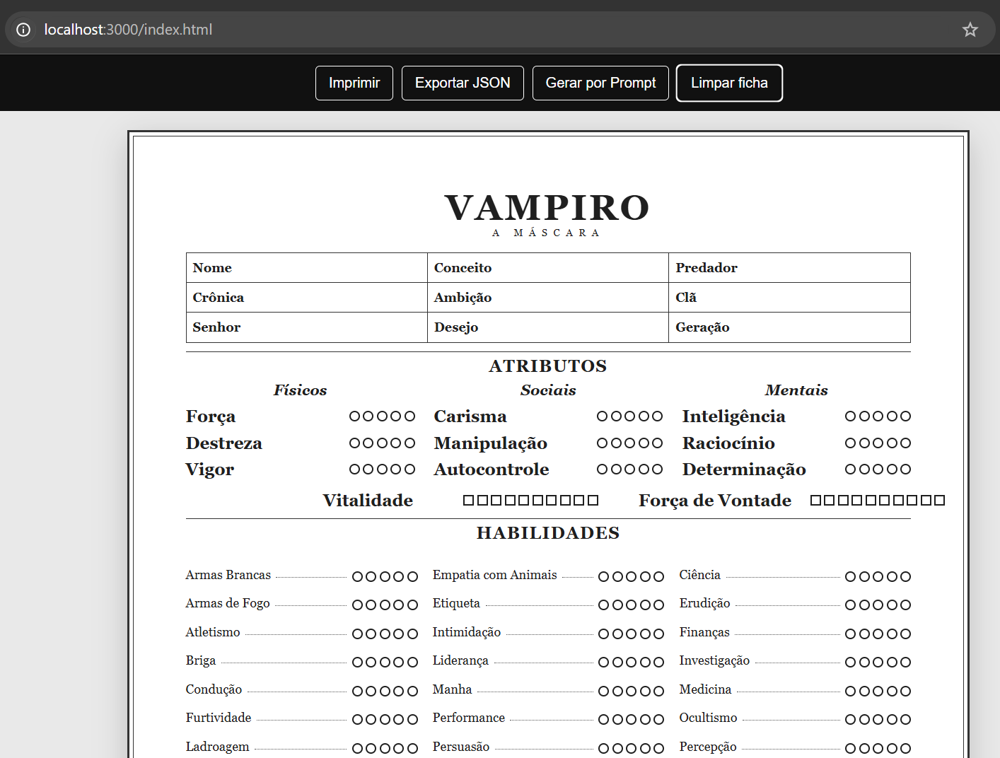
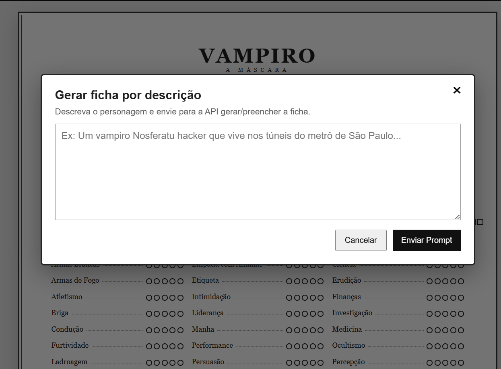

# Gerador de personsagem

### Todo mestre de RPG sabe...
Criar personagens para uma campanha de RPG de mesa pode ser uma das partes mais legais da preparacao, mas tambem uma das mais demoradas. 

> <u>Todo mestre conhece a cena</u>: *horas montando um NPC, ajustando atributos, distribuindo habilidades e pensando em detalhes de historia para um personagem que talvez apareca por poucos minutos na sessao.*

O **Vampiro App** nasceu para aliviar essa dor. Ele ajuda mestres e jogadores de **Vampiro: A Mascara V5** a criar, preencher, imprimir e exportar fichas de personagem de forma rapida, visual e organizada.



**Quando a campanha precisa de um personagem <u>agora</u>, o app entra como o salvador da noite.**

### Geração de personagem com IA ✨
O grande diferencial esta na geracao com IA: o mestre pode descrever o personagem em um prompt, como "*um Nosferatu informante que vive nos tuneis da cidade e vende segredos para qualquer seita*", e o app gera uma ficha inicial pronta para editar, usar ou imprimir.



## O que o projeto faz

- Permite preencher dados do personagem, cronica, atributos, habilidades, disciplinas, vantagens, defeitos, biografia e notas.
- Permite marcar bolinhas de nivel e caixas de trilha diretamente na interface.
- Gera personagens por prompt usando IA, acelerando a criacao de NPCs e personagens secundarios.
- Ajuda mestres a improvisar ou preparar personagens sem gastar horas em fichas que podem aparecer por poucos minutos na campanha.
- Exporta a ficha preenchida como arquivo JSON.
- Permite imprimir a ficha pelo navegador.
- Possui uma rota de API para gerar e preencher a ficha a partir de uma descricao textual.
- Usa dados mockados quando a IA esta desativada ou sem chave configurada.

## Como baixar

Clone o repositorio:

```bash
git clone <URL_DO_REPOSITORIO>
cd vampiro-app
```

Instale as dependencias:

```bash
npm install
```

## Configuracao do ambiente

Crie um arquivo `.env` a partir do exemplo:

```bash
cp .env.example .env
```

Edite o `.env` com as suas configuracoes:

```env
OPENAI_API_KEY=sua_chave_aqui
USE_AI=false
```

Variaveis:

- `OPENAI_API_KEY`: chave da API usada pela rota de geracao por IA.
- `USE_AI`: define se a integracao real com IA sera usada. Use `true` para ativar e `false` para manter os dados de exemplo.

Por padrao, deixe `USE_AI=false` se voce quiser rodar apenas a versao visual/local sem consumir API externa.

## Como usar na sua maquina

Rode o servidor de desenvolvimento:

```bash
npm run dev
```

Abra no navegador:

```text
http://localhost:3000/index.html
```

Na tela da ficha, voce pode:

- preencher os campos manualmente;
- usar **Exportar JSON** para baixar os dados preenchidos;
- usar **Imprimir** para gerar uma versao impressa;
- usar **Gerar por Prompt** para pedir a criacao de uma ficha a partir de uma descricao.

## Usando a geracao por IA

Para ativar a geracao real por IA, configure o `.env` assim:

```env
OPENAI_API_KEY=sua_chave_real
USE_AI=true
```

Depois reinicie o servidor:

```bash
npm run dev
```

Quando `USE_AI` nao estiver como `true`, ou quando `OPENAI_API_KEY` nao existir, o app nao chama a API externa. Nesse caso, ao usar **Gerar por Prompt**, ele carrega uma ficha de exemplo.

## Rodando com Docker

Tambem e possivel subir o projeto com Docker Compose:

```bash
docker compose up --build
```

Depois acesse:

```text
http://localhost:3000/index.html
```

## Dados mockados em producao

Para fins de seguranca e demonstracao, a versao de exemplo pode trabalhar com dados mockados. Isso evita expor chaves, dados reais ou integracoes sensiveis em ambientes publicos.

Ou seja: a ficha mockada serve como exemplo visual e funcional da experiencia. Em um ambiente real de producao, a integracao com IA deve ser habilitada somente com variaveis de ambiente seguras e configuradas no provedor de hospedagem, sem commitar chaves no repositorio.

## Stack utilizada

- Next.js
- JavaScript
- HTML
- CSS
- OpenAI API
- Docker
- ESLint
#vampiro-app
